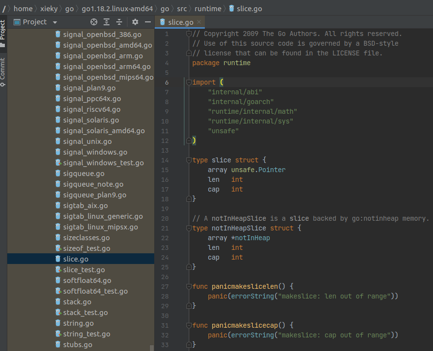

### Package

>  Go 语言中的包和其他语言的库或模块的概念类似，目的都是为了支持模块化、封装、单独编译和代码重用。
>
> 一个包的源代码保存在一个或多个以.go 为文件后缀名的源文件中。

- 包引用及结构例子如下图

  

- 声明

  包的声明在目录内的 `.go` 文件首行，通常包名与包路径的最后一个字段相同，**包内每个 `.go` 文件声明的包名必须一致**

  ```go
  package sample
  ```

- 导入

  ```go
  package main
  
  import (
      "log"
  
      // $GOPATH/pkg/mod/gitlab.mvalley.com/surefive1/gardener/golang/sample/constants
      "gitlab.mvalley.com/surefive1/gardener/golang/sample/constants"
  )
  
  func main() {
      log.Println(constants.Global)
  }
  ```

- 别名

  ```go
  package main
  
  import (
      "log"
      logger "gitlab.mvalley.com/surefive1/gardener/golang/sample/log"
  )
  
  func main() {
      log.Println(logger.Global)
  }
  ```

- 每个包都对应一个独立的命名空间

  ```go
  package main
  
  import (
      "log"
  
      "gitlab.mvalley.com/surefive1/gardener/golang/sample/constants"
      "gitlab.mvalley.com/surefive1/gardener/golang/sample/variables"
  )
  
  func main() {
      log.Println(variables.Global)
      log.Println(constants.Global)
  }
  ```

- **通过变量名首字母大小写来区分变量能否被其他包引用**

  ```go
  package constants
  
  var privateName = "private"
  var PublicName = "public"
  ```

  问：下面的代码有什么问题？

  ```go
  package main 
  
  import (
    "gitlab.mvalley.com/surefive1/gardener/golang/sample/constants"
     "fmt"
  )
  
  func main(){
      fmt.Println(constants.privateName)
      fmt.Println(constants.PublicName)
  }
  ```


#### GO Mudule

- 创建一个使用 go modules 的项目

  ```bash
  mkdir gardener
  
  cd gardener/
  
  go mod init gitlab.mvalley.com/surefive1/gardener
  ```

- go.mod

  ```go
  module gitlab.mvalley.com/surefive1/gardener // 当前项目的 module 名称
  
  go 1.18
  ```

- 新建一个 main.go

  ```go
  package main
  
  import (
      "github.com/sirupsen/logrus"
      "gitlab.mvalley.com/surefive1/gardener/golang/sample/constants"
  )
  
  func main() {
      logger := logrus.New()
      logger.Println(constants.Global)
  }
  ```

- 运行命令 `go mod tidy`，go.mod 文件就会添加下面一行代码

  ```
  require github.com/sirupsen/logrus v1.8.1
  ```

#### 语义化版本递增规则

- [Semver](https://semver.org/lang/zh-CN/) 摘要

  ```
  版本格式：主版本号.次版本号.修订号，版本号递增规则如下：
  
  主版本号：当你做了不兼容的 API 修改，
  次版本号：当你做了向下兼容的功能性新增，
  修订号：当你做了向下兼容的问题修正。
  先行版本号及版本编译信息可以加到“主版本号.次版本号.修订号”的后面，作为延伸。
  
  e.g: 1.9.1 -> 1.10.0 -> 1.11.0
  ```

- 版本校验比较工具：[Go Version](https://github.com/hashicorp/go-version)


